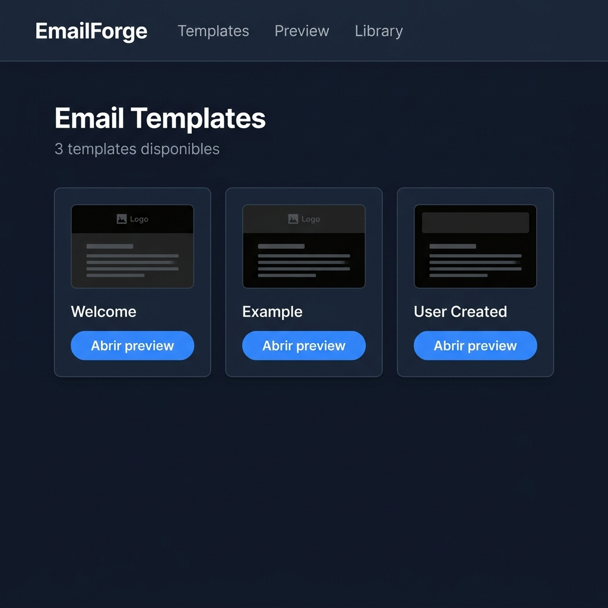
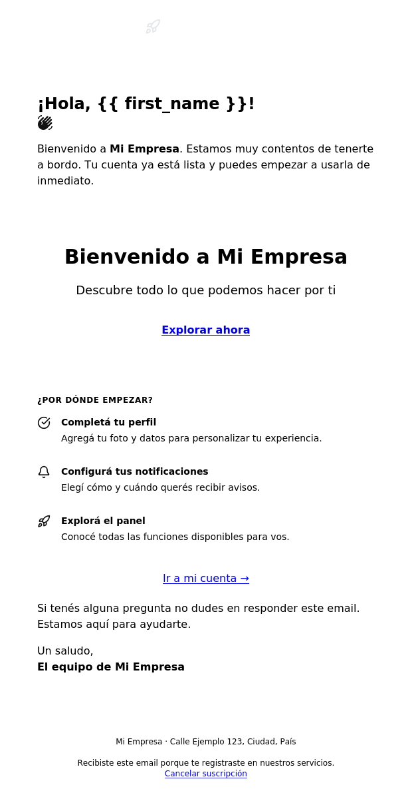
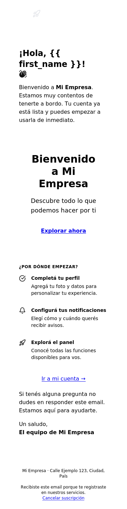

# EmailForge Toolkit

[](https://github.com/Frank-0511/vite-mhb-email/actions/workflows/ci.yml)

Sistema de desarrollo, preview, validacion y exportacion de templates HTML de
email. Integra **Bun**, **Vite**, **Maizzle** y **Handlebars** para editar
emails con preview local, compilar HTML compatible con clientes de email y
generar archivos finales planos en `dist/<template>.html`.

---

## El problema

Crear emails HTML compatibles con Gmail, Outlook y Apple Mail es tedioso: el
CSS debe estar inline, las imagenes requieren atributos de dimension, las
variables del ESP deben quedar intactas en el output y verificar el resultado en
distintos viewports requiere cambiar archivos a mano.

## La solucion

EmailForge Toolkit te da un entorno de desarrollo local completo para emails:

- **Preview en vivo** con datos de muestra renderizados por Handlebars.
- **Compilacion con Maizzle** que aplana el CSS y preserva las variables ESP.
- **Validacion de compatibilidad** con gate que bloquea el build ante errores
  reales (CSS no soportado, imagenes sin dimensiones, etc.).
- **Libreria de componentes** con schema editable desde la UI.
- **CLI interactivo** para crear templates, enviar a Mailtrap y exportar PNG.

---

## Stack

| Herramienta                             | Rol                                                   |
| --------------------------------------- | ----------------------------------------------------- |
| [Bun](https://bun.sh)                   | Runtime y package manager oficial                     |
| [Vite](https://vite.dev)                | Dev server del dashboard, preview y component library |
| [Maizzle](https://maizzle.com)          | Build final de emails con componentes y purge CSS     |
| [Handlebars](https://handlebarsjs.com)  | Datos de preview sin consumir variables del ESP       |
| [Tailwind CSS](https://tailwindcss.com) | CSS de preview y CSS especializado para email         |

---

## Arquitectura

```text
src/
├── emails/
│   ├── layouts/        # Layouts base de email (main.html, layout-alt.html)
│   ├── partials/       # Componentes reutilizables con schema.json
│   │   └── organisms/
│   │       ├── hero/
│   │       ├── key-value-card/
│   │       └── supporting-section/
│   ├── styles/         # CSS especializado para email (Tailwind email config)
│   └── templates/      # Templates de producto (index.html + data.json)
│       ├── welcome/
│       ├── example/
│       └── user-created/
└── web/                # Dashboard Vite (preview + libreria de componentes)
    ├── features/
    │   ├── home/       # Lista de templates
    │   ├── preview/    # Editor + iframe + viewport controls
    │   └── library/    # Libreria de componentes con form-renderer
    └── shared/

scripts/
├── build/              # Pipeline: build.js, validate-email-html.js, check-html-size.js
├── cli/                # CLI de 8 acciones (modular)
├── exporters/          # Export PNG (wkhtmltoimage → puppeteer fallback)
├── generators/         # Generador de templates (g:email)
├── shared/             # Utilidades: handlebars, paths, env, path-safety
└── vite/
    ├── api/            # Endpoints Vite: /api/render, /api/copy-html, etc.
    ├── plugins/        # Plugins Vite custom
    └── services/       # maizzle-compiler.js con cache por template+theme+dataHash
```

El pipeline principal es:

```text
[editar template] → [bun run dev] → [preview Handlebars] → [bun run build]
      → [Maizzle inline CSS] → [flatten dist/<t>.html] → [validar compatibilidad]
```

---

## Capturas

### Dashboard — lista de templates



### Preview de email — escritorio



### Preview de email — movil (375 px)



---

## Instalacion

```bash
git clone https://github.com/Frank-0511/vite-mhb-email.git
cd vite-mhb-email
bun install
```

> Requiere **Node.js >= 20** y **Bun >= 1.0.0**.

---

## Desarrollo

```bash
bun run dev
```

Vite abre el dashboard local en `http://localhost:5173`. Desde ahi puedes:

- ver todos los templates disponibles;
- abrir el preview/editor de cada email;
- alternar tema claro/oscuro;
- acceder a la libreria de componentes reutilizables.

### Rutas de la app web

| Ruta       | Vista                                    |
| ---------- | ---------------------------------------- |
| `/`        | Dashboard de templates                   |
| `/preview` | Preview/editor de templates              |
| `/library` | Libreria de componentes HTML para emails |

---

## Build de Produccion

```bash
bun run build
```

El comando ejecuta lint y luego el pipeline del proyecto. No uses `maizzle build`
como comando final directo.

El build hace lo siguiente:

- cambia temporalmente al CSS especializado para email;
- compila templates con Maizzle;
- conserva las variables ESP `{{ variable }}`;
- inyecta media queries necesarias para email;
- aplana la salida a `dist/<template>.html`;
- valida tamano y compatibilidad del HTML generado;
- **falla con exit code 1 si hay errores de compatibilidad** (CSS no soportado,
  imagenes sin dimensiones, etc.); los warnings no bloquean.

---

## Delimitadores

| Sintaxis              | Uso                                             |
| --------------------- | ----------------------------------------------- |
| `[[ page.variable ]]` | Variables internas de Maizzle/front matter      |
| `{{ variable }}`      | Variables del ESP, renderizadas solo en preview |

Durante el preview, Handlebars usa `data.json` para mostrar valores de ejemplo.
Durante el build final, las variables `{{ }}` quedan intactas para que el ESP
las resuelva al enviar el email.

---

## Anatomia de un Template

```html
---
title: "Titulo visible en el layout"
previewText: "Texto de preview en inbox"
titleTemplate: "Nombre en el dashboard"
---

<x-main>
  <h1>[[ page.title ]]</h1>
  <p>Hola {{ first_name }}, este texto va al ESP.</p>
  <a href="{{ cta_url }}">Ir</a>
</x-main>
```

Cada template debe tener datos de preview:

```json
{
  "titleTemplate": "Welcome",
  "first_name": "Frank",
  "cta_url": "https://example.com/dashboard"
}
```

---

## Componentes

Los componentes viven en `src/emails/partials/` y pueden incluir un `schema.json`
para describir campos editables en la UI de la libreria.

```bash
# Crear un nuevo template
bun run g:email <nombre>
```

El generador crea `src/emails/templates/<nombre>/{index.html,data.json}`.

---

## CLI

```bash
bun run cli
bun run cli --help
```

| Opcion | Accion                                               |
| ------ | ---------------------------------------------------- |
| `1`    | Levantar servidor de desarrollo                      |
| `2`    | Buildear para produccion                             |
| `3`    | Crear nuevo template                                 |
| `4`    | Enviar template a Mailtrap                           |
| `5`    | Testear con Mail-Tester via Gmail SMTP               |
| `6`    | Enviar a bandeja real (Gmail / Outlook / Apple Mail) |
| `7`    | Exportar template como PNG                           |
| `8`    | Validar compatibilidad email                         |
| `0`    | Salir                                                |

---

## Validacion y Calidad

```bash
bun run lint          # HTML + JS + Markdown + JSON + CSS
bun run validate-email
bun run typecheck     # JSDoc + checkJs (scripts/shared + scripts/build)
bun run test          # bun test (*.test.js)
bun run format:check
```

### Reglas de compatibilidad email

| Severidad | Regla                   | Valida                                    |
| --------- | ----------------------- | ----------------------------------------- |
| Error     | `img-dimensions`        | Imagenes con `width` y `height` HTML      |
| Error     | `css-unsupported-props` | CSS problematico en clientes de email     |
| Error     | `doctype-present`       | Presencia de `<!doctype html>`            |
| Error     | `no-js-in-email`        | Ausencia de `<script>` en el output final |
| Warning   | `img-alt`               | Texto alternativo en imagenes             |
| Warning   | `link-targets`          | Links reales en vez de `href="#"`         |
| Warning   | `max-width-check`       | Ancho razonable para email                |
| Warning   | `unsubscribe-link`      | Link de desuscripcion                     |
| Info      | `color-scheme-meta`     | Metadata de color scheme                  |
| Info      | `nested-tables-depth`   | Profundidad de tablas anidadas            |

Los errores bloquean el build. Los warnings son informativos.

---

## Variables de Entorno

```bash
cp .env.example .env
```

### Mailtrap

```env
MAILTRAP_API_TOKEN=
MAILTRAP_INBOX_ID=
MAILTRAP_FROM_EMAIL=
MAILTRAP_FROM_NAME=
MAILTRAP_TO_EMAIL=
MAILTRAP_TO_NAME=
```

### Gmail SMTP

Requiere un App Password de Google:
<https://myaccount.google.com/apppasswords>

```env
GMAIL_USER=
GMAIL_APP_PASS=
SMTP_FROM_NAME=
MAILTESTER_TO_EMAIL=
TEST_GMAIL_TO=
TEST_OUTLOOK_TO=
TEST_APPLE_TO=
```

---

## Scripts de Referencia

```bash
bun install              # Instalar dependencias
bun run dev              # Servidor de desarrollo
bun run build            # Build de produccion (lint + Maizzle + validacion)
bun run test             # Suite de tests (bun:test)
bun run test:watch       # Tests en modo watch
bun run typecheck        # Verificacion de tipos JSDoc
bun run lint             # Lint completo (HTML / JS / Markdown / JSON / CSS)
bun run validate-email   # Solo el validador de compatibilidad email
bun run cli              # Interfaz CLI interactiva
bun run format           # Aplicar Prettier
bun run format:check     # Verificar formato Prettier
bun run build-selective  # Build de templates especificos
bun run check-size       # Verificar tamano del HTML generado
bun run agents:sync      # Sincronizar skills de agentes
```

---

## Requisitos

- Node.js >= 20
- Bun >= 1.0.0

---

## Notas para Agentes

Las reglas operativas viven en `docs/AGENTS.md` y en las skills repo-locales de
`docs/agent-skills/`. Antes de modificar build, Vite, Maizzle, Handlebars,
templates, CLI, validadores o scripts, lee la skill correspondiente.
